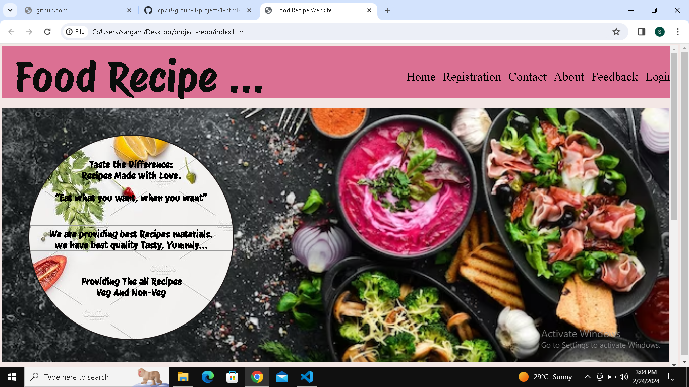
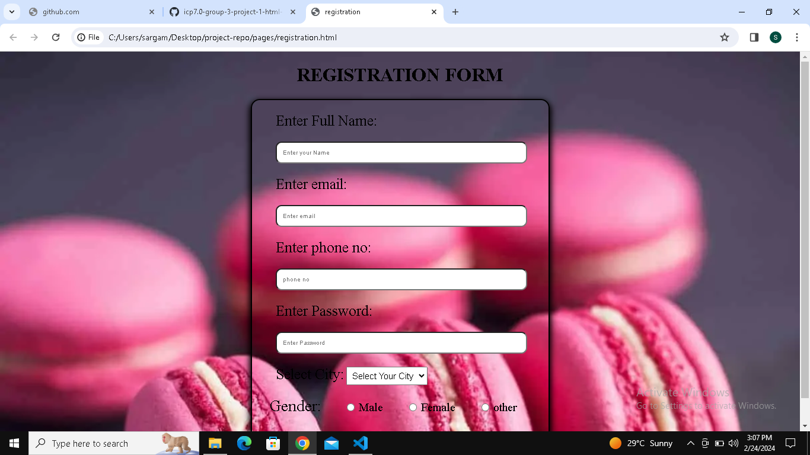
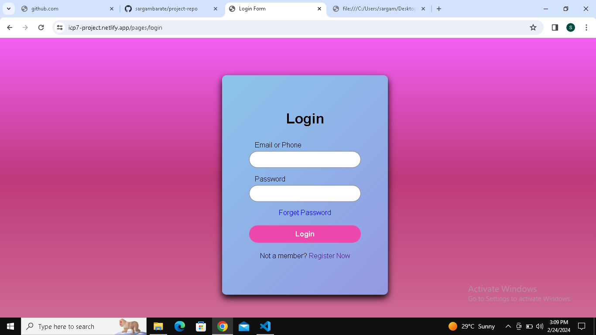
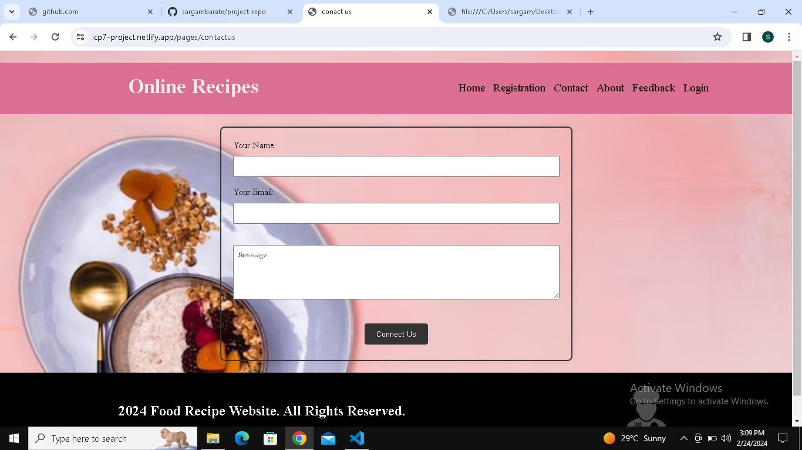
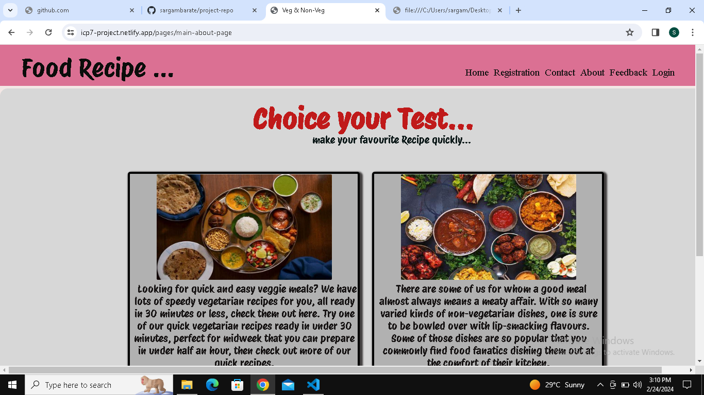
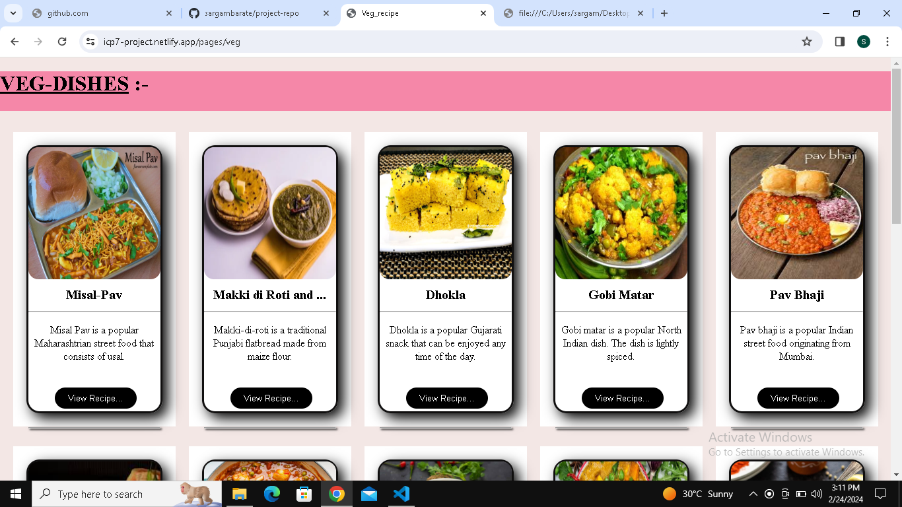
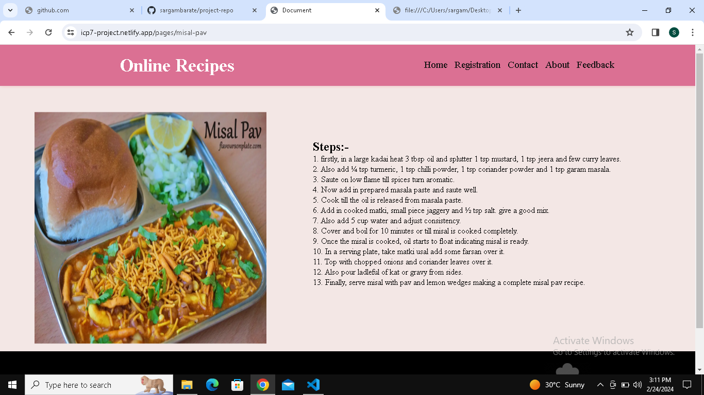
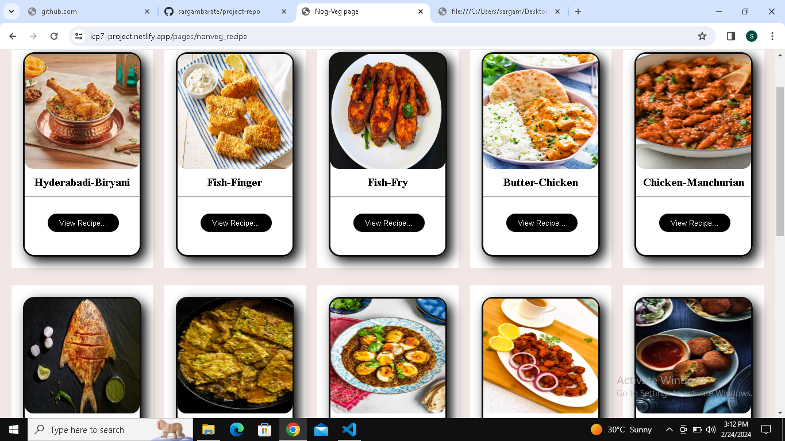
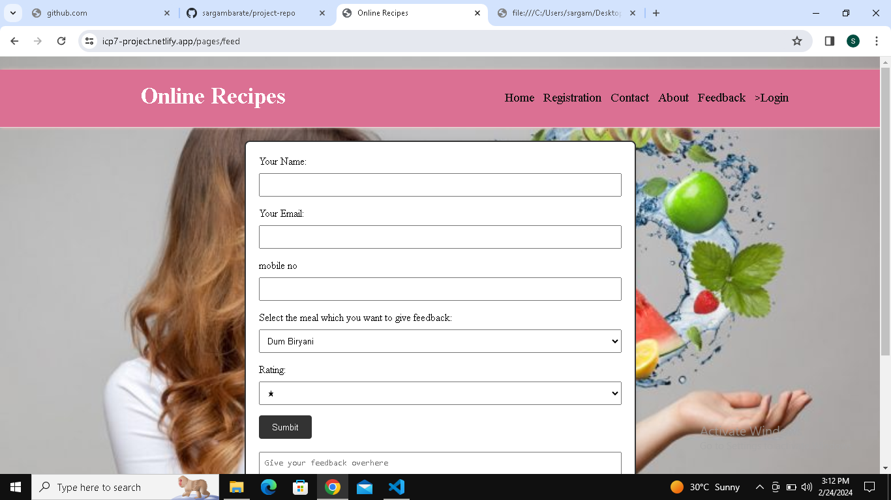

## icp-7-group-4-html-css--project-1

# Online Food Recipes 
##  Welcome To Our  Food Recipes...

### The following are images from the website :

###  Home Page

### Registration page

### Login page

###  Contact Page

###  About Page

### Ven-recipes page

###  Veg-recipes-Step

### Non-veg Recipes page
![Non-veg Recipes]](./ss/non-veg-recipe.PNG)

###  Non-veg-recipes-Step

###  Feedback page

### Description 
The project is made using the basics of **HTML**  and **CSS**.
The website is the frontend implementation of a Online Food Recipes.

### Description of work :

Every member created a page in the project

1. Home Page - Nandini
2. Registration - Suraj Jagtap
3. Login-  Prachi
4. Contact - Shruti 
5. About - Kanchan
6. Veg-Recipes page - Vaibhavi
7. Veg-Recipes-Step page - Vaibhavi 
8. Non-Veg-Recipes page - Sargam Barate
9. Non-Veg-Recipes-Step page - Sargam Barate 
10. Feedback - Uruj Khan 

